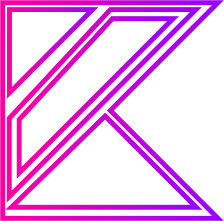

<div align="center">
  <br>
  
<h1>Kotlin Surreal Database API</h1>
  <h6>KSDB | by Necrosis</h6>

<p>
    SurrealDB framework for Kotlin
  </p>

<!-- Badges -->

<p>
  <a href="https://github.com/N3cr0s1s/KSDB/graphs/contributors">
    
  </a>
  <a href="">
    
  </a>
  <a href="https://github.com/N3cr0s1s/KSDB/network/members">
    
  </a>
  <a href="https://github.com/N3cr0s1s/KSDB/stargazers">
    
  </a>
  <a href="https://github.com/N3cr0s1s/KSDB/issues/">
    
  </a>
  <a href="https://github.com/N3cr0s1s/KSDB/blob/master/LICENSE">
    
  </a>
</p>

<h4>
    <a href="https://github.com/N3cr0s1s/KSDB">Documentation</a>
  <span> · </span>
    <a href="https://github.com/N3cr0s1s/KSDB/issues/">Report Bug</a>
  <span> · </span>
    <a href="https://github.com/N3cr0s1s/KSDB/issues/">Request Feature</a>
  </h4>
</div>

<br />

<!-- Table of Contents -->

# 📔 Table of Contents

<!-- TOC -->
* [📔 Table of Contents](#-table-of-contents)
* [🗒️ Kotlin SurrealDB](#-kotlin-surrealdb)
  * [API](#api)
    * [🌟 Create SurrealDB](#-create-surrealdb)
      * [📑 Synchronized](#-synchronized)
      * [📑 Asynchronous](#-asynchronous)
  * [🖼️ KSDB (framework)](#-ksdb--framework-)
    * [📚 Table Handler](#-table-handler)
      * [Create entity](#create-entity)
      * [Find entity](#find-entity)
        * [Query](#query)
        * [Delete](#delete)
        * [Update](#update)
    * [📇 Create table entity](#-create-table-entity)
    * [🪢 Relation](#-relation)
    * [📝 Database function annotations](#-database-function-annotations)
      * [🔐 Crypto](#-crypto)
      * [🔣 Random](#-random)
      * [⚡ Session](#-session)
      * [🧮 Math](#-math)
    * [🗺️ Mapper](#-mapper)
  * [🧭 Todos](#-todos)
  * [👋 Contributing](#-contributing)
  * [⚠️ License](#-license)
<!-- TOC -->

# 🗒️ Kotlin SurrealDB

This implementation has 2 parts,
one is responsible for connection and requests,
the other is a framework.

<!-- API -->

## API

<code>me.necrosis.surrealdb.api.SurrealDB</code> is an abstract class, used to handle sync, and async functions. <br>
Because this, every function returns a new <code>me.necrosis.surrealdb.api.util.Task</code>.
<br><br>

### 🌟 Create SurrealDB

#### 📑 Synchronized

```kotlin
/**
 * SYNCHRONIZED
 */
val syncSurrealDB = SyncSurrealDB(
  "localhost:8000",     //  Host
  "test",               //  Database
  "test",               //  Namespace
  User("root","root")   //  User
)
syncSurrealDB.connect().get { isConnected /* Is connected boolean */ ->
    if(isConnected) println("Connected")
    else println("Error")
}
println("After connected")

//  Output :
//  ---------------
//  Connected
//  After connected
```

#### 📑 Asynchronous

```kotlin
/**
 * ASYNCHRONOUS
 */
val asyncSurrealDB = AsyncSurrealDB(
    "localhost:8000",     //  Host
    "test",               //  Database
    "test",               //  Namespace
    User("root","root")   //  User
)
asyncSurrealDB.connect().get { isConnected /* Is connected boolean */ ->
    if(isConnected) println("Connected")
    else println("Error")
}
println("Before connected")

//  Output :
//  ---------------
//  Before connected
//  Connected
```

API only can perform simple requests to server, for more info see the
<a href="https://surrealdb.com/docs/integration/http">official documentation</a>.

Possible functions with API

```
SurrealDB#sql(query: String) // Allows custom SurrealQL queries
SurrealDB#select(table: String) // Selects all records in a table from the database
SurrealDB#select(record: Record) // Selects the specific record from the database
SurrealDB#create(table: String, data: JSONObject) // Creates a records in a table in the database
SurrealDB#create(record: Record, data: JSONObject) // Creates a records in a table in the database
SurrealDB#delete(table: String) // Deletes all records in a table from the database
SurrealDB#delete(record: Record) // Deletes the specified record from the database
SurrealDB#update(record: Record, data: JSONObject) // Updates the specified record in the database
SurrealDB#modify(record: Record, data: JSONObject) // Modifies the specified record in the database
```

## 🖼️ KSDB (framework)

KSDB is the framework for the library.
Automatically create records to database, and create objects,
which parameters match with the record data.

### 📚 Table Handler

KSDB main tool is the `me.necrosis.surrealdb.framework.component.table.TableHandler`.
This connects object mapper and the table entity, to make object mapping automatic.
<br>
Table handler needs a table entity, in generic type, or with table entity class, in `get` parameter.

#### Create entity

This function automatically run in asynchronous, but you can set `wait` param to true,
then the thread is wait for the job end.<br>
You can get the `JSONObject` callback if you want, with the `callback` param, which is
follows the format `(JSONObject)->Unit`.<br>
The `wait`, and the `callback` params, is optional, because params have default values.

```kotlin
val KSDB = KSDB(
  SyncSurrealDB("localhost:8000","test","test", User("root","root"))
)

val testEntityTableHandler = KSDB.get<TestEntity>()

testEntityTableHandler.create(
    TestEntity(id="entityID",name="testName",age=16),
    wait = true
  ){ json ->
      println(json.toString())
  }

```

#### Find entity

You can find table entity from `ID`, or with `Query` object.<br>
Results is created with the object mapper automatically.<br>
All find function return a new `CompletableFuture`, to handle asynchronous methods.

```kotlin
val KSDB = KSDB(
  SyncSurrealDB("localhost:8000","test","test", User("root","root"))
)

val testEntityTableHandler = KSDB.get<TestEntity>()

testEntityTableHandler.find("entityID") //  This will return a new CompletableFuture with TestEntity object, with the database values.
                                        //  If record not exist with this ID, then return null.
```

##### Query

Query object responsible to create filter, to find entities, in the database.<br>
This object holds the QueryFields. QueryField contains 4 parameters

- QueryType
- Field Name
- Field Value
- *Or* state, which is a new QueryField, but this field is optional

```kotlin
val query = Query()
val request = query.add(
            QueryField(
                QueryType.EQUALS,   //  Query Type
                "name",             //  Field name
                "Michael",          //  Field value
                QueryField(         //  Or state
                    QueryType.EQUALS,
                    "name",
                    "Thomas"
                )
            ),
            QueryField(QueryType.GREATER,"age",16)
        )

val requestGetOutput = "(name = \"Michael\" OR name = \"Thomas\") AND age > 16 "
testEntityTableHandler.find(request)
```

##### Delete

Delete entire table with `TableHandler#deleteTable(wait,callback)`<br>
Delete record with id `TableHandler#delete(id,wait,callback)`<br>
Delete with where case `TableHandler#delete(where,wait,callback)`<br>

##### Update

Update entity use a table entity, and his `ID` field.<br>

`TableHandler#update(entity,wait,callback)` <br>

### 📇 Create table entity

To use object mapping, you must create a table entity,
which must contains an empty constructor `constructor()` ,an `ID` field, and a `@Table(tableName)` annotation.

```kotlin
@Table("testTable") //  Table name, to save the record
data class TestEntity(
    @Id val id:String? = null,  //  ID field
    val name:String? = null,
    val age:Int? = null
)
```

### 🪢 Relation

KSDB make relations easier, just add table entity to an already
created table entity.

```kotlin
@Table("Person") //  Table name, to save the record
data class Person(
    @Id val id:String? = null,  //  ID field
    val name:String? = null,
    val age:Int? = null,
    val params:PersonParams? = null   //  Relation field
)

@Table("PersonParams") //  Table name, to save the record
data class PersonParams(
    @Id val id:String? = null,  //  ID field
    val height:Int? = null,
    val weight:Int? = null
)
```

### 📝 Database function annotations

SurrealQL has built-in functions,
for more information see the
<a href="https://surrealdb.com/docs/surrealql/functions">official documentation</a>.
You can use some functions, with field annotations.

#### 🔐 Crypto

Crypto function is a hashing function. Use on String fields,
and it's automatically saves the hashed value, to the database.
<br>

> **Warning**
> The real value travels once to the database to return the hashed value!

All crypto function is implemented, except compare functions,
see the <a href="https://surrealdb.com/docs/surrealql/functions/crypto">CRYPTO function documentation</a>.

```kotlin
@Table("testTable") //  Table name, to save the record
data class TestEntity(
    @Id val id:String? = null,  //  ID field
    val name:String? = null,

    @Crypto(CryptoType.SHA256)  //  Crypto function
    val password:String?=null,

    val age:Int? = null
)

TestEntity(id="test",name="testName",password="StrongPassword",age=19)
//  The saved record is:
//      id: testTable:test
//      name=testName
//      password=05a181f00c157f70413d33701778a6ee7d2747ac18b9c0fbb8bd71a62dd7a223
//      age=19
```

> **Note**
> When requesting an entity, it returns with the already hashed value, and the original value is not returned anywhere.

#### 🔣 Random

Random functions, to generate random value, and save to field value.<br>
Random annotation has 4 parameters

- Random tye
  - **RAND** - Generates and returns a random floating point number
  - **BOOL** - Generates and returns a random boolean
  - **FLOAT** - Generates and returns a random floating point number
  - **RFLOAT** - Generates and returns a random floating point number, in a specific range
  - **GUID** - Generates and returns a random guid
  - **LGUID** - Generates and returns a random guid, with length
  - **INT** - Generates and returns a random integer
  - **RINT** - Generates and returns a random integer, in a specific range
  - **STRING** - Generates and returns a random string
  - **LSTRING** - Generates and returns a random string, with length
  - **RSTRING** - Generates and returns a random string, in a specific range
  - **TIME** - Generates and returns a random datetime
  - **RTIME** - Generates and returns a random datetime, in a specific range
  - **UUID** - Generates and returns a random UUID
- Min
- Max
- Length

If random type value start with **R**, means ***RANGE***,
if start with **L**, means ***Length***. So if you use random type,
which start with **R**, then set **min** and **max** value in annotation.
If random type start with **L**, then set **Length** value in annotation.

> **Note**
> Parameters have default values,<br>
> min = 0, <br> max = 100, <br>length = 15

#### ⚡ Session

Session annotation is responsible for database sessions.
This annotation set the field value, to selected session.

- **DB** - Returns the currently selected database
- **ID** - Returns the current user's session ID
- **IP** - Returns the current user's session IP address
- **NS** - Returns the currently selected namespace
- **ORIGIN** - Returns the current user's HTTP origin
- **SC** - Returns the current user's authentication scope

#### 🧮 Math

Math annotation allows to run math functions, even if the function require an array.
This annotation has two type of query

- **Default**
- **ARR_**

If MathType starts with a `ARR_`, then `arrayFieldName` field is required.
If MathTye is `FIXED`, then `fixed` field is required.
<br><br>
All the SurrealDB Math function is implemented, see the <a href="https://surrealdb.com/docs/surrealql/functions/math">MATH function documentation</a>.

- **ABS** 	Returns the absolute value of a number
- **CEIL**  Rounds a number up to the next largest integer
- **FIXED** Returns a number with the specified number of decimal places
- **FLOOR** Rounds a number down to the next largest integer
- **ARR_MAX** Returns the maximum number in a set of numbers
- **ARR_MEAN** Returns the mean of a set of numbers
- **ARR_MEDIAN** Returns the median of a set of numbers
- **ARR_MIN** Returns the minimum number in a set of numbers
- **ARR_PRODUCT** Returns the product of a set of numbers
- **ROUND** Rounds a number up or down to the nearest integer
- **SQRT** Returns the square root of a number
- **ARR_SUM** Returns the total sum of a set of numbers

> **Warning**
> If you use the array function, make sure to use the same object type for the output field as the generic type of the array.
> Like this
> ```kotlin
>    var math: Array<Int>? = null
> 
>    @Math(MathType.ARR_MAX, arrayFieldName = "math")
>    var mathArrayMax: Int? = null
> 
>    @Math(MathType.ARR_MIN, arrayFieldName = "math")
>    var mathArrayMin: Int? = null
> ```
> In this case, you can't use `Double` field on `mathArrayMax` or `mathArrayMin` field, only `Int`, like the array type.

### 🗺️ Mapper


<!-- Roadmap -->

## 🧭 Todos

* [ ]  Rules to specify input data
* [ ]  Extend annotation functions
* [ ]  Bug fixing
* [ ]  Date time adapter

<!-- Contributing -->

## 👋 Contributing

<a href="https://github.com/N3cr0s1s/KSDB/graphs/contributors">
  
</a>

Contributions are always welcome!

<!-- License -->

## ⚠️ License

Distributed under the MIT License. See LICENSE for more information.